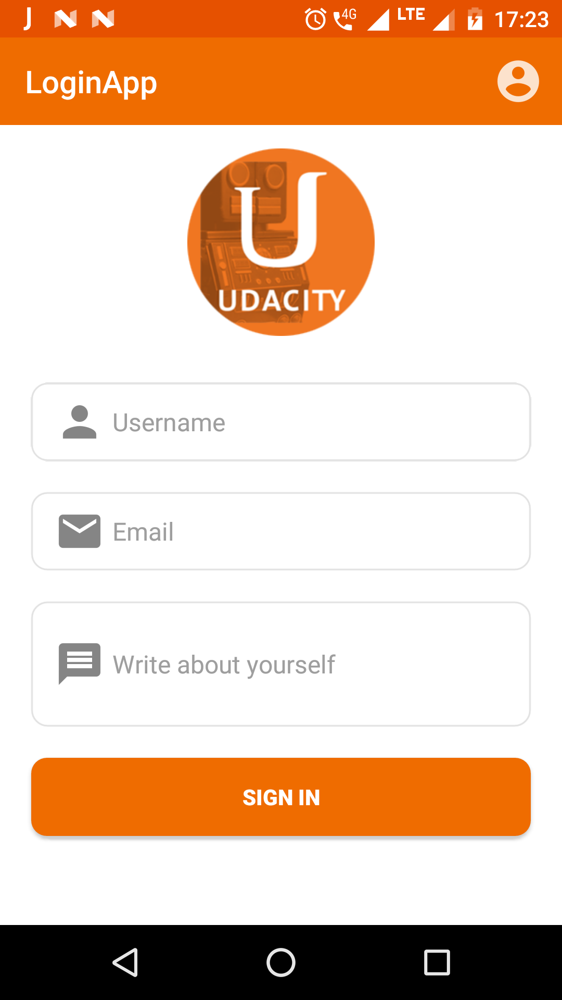
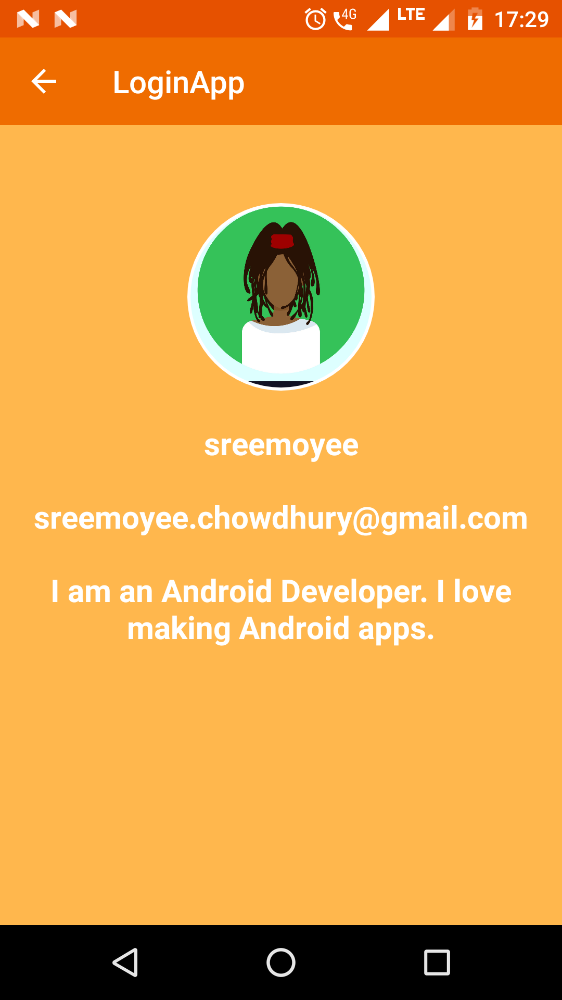

# LoginApp

This is a small demo application for UdacityPracticalQuizOne to test the knowledge on restoring the state of an activity on configuration changes or when the user restarts the app and on SharedPreferences to store the edittext values.

### Screenshots
  

